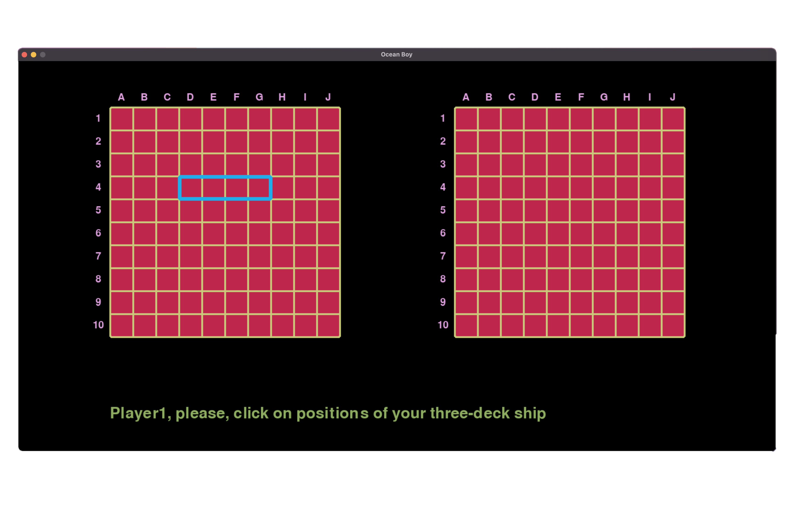

# Battleship game

### About

Overview:
The Sea Battle game, developed using the Pygame library, is an engaging and interactive game that simulates naval warfare. This document briefly describes the architecture and design patterns utilized in the game to ensure a seamless gaming experience, efficient performance, and maintainable code.

Architecture:
The game follows a component-based architecture, which breaks down the game into modular components, each responsible for specific functionality. This approach allows for easy development, testing, and modification of individual components, without affecting the overall system.

Key Components:
Game Engine - The core component that handles game loop, event processing, and game state management.
Renderer - Responsible for drawing and updating the game visuals on the screen.
Input Handler - Processes user input from mouse, triggering corresponding in-game actions.
Game Objects - Includes various game elements, such as ships, projectiles, and power-ups, each represented by individual classes.

Design Patterns:
Model-View-Controller Patten - Used to separate the game logic from the geometry realization. By using the MVC pattern, the Battleship game can be designed to be modular and easier to maintain. Each component can be tested independently, and changes to one component will not affect the others, as long as the interface between the components remains the same.

Observer Pattern - Applied to manage game events and notifications, allowing different components to subscribe and react to specific events. This pattern was chosen for its ability to promote loose coupling between components and simplify communication.
State Pattern - Implemented for game state management, enabling the game to transition between different states (e.g., entering positions of ships, playing, and game over) smoothly. This pattern allows for efficient state management and ensures a more organized code structure.
In conclusion, the architecture and design patterns employed in the Battleship game provide a robust, flexible, and maintainable structure, ensuring a smooth and enjoyable gaming experience for players.

### Description

The object of the game "Battleship" is to sink all of the other player's ships before he sinks yours.


### Features

Grid Coordinates: Each square on the board is identified by a letter and number coordinate system, such as "A1", "B2", "C3", and so on.

Game Start: Each player places own ships on own board by clicking on cells. At the bottom of the screen there are hints telling which kind of ships needs to be put. If a player made a mistake in the placement, a message at the bottom will indicate exactly what was wrong.




When all ships are placed, the players start making moves.


Guessing: Players take turns guessing the location of their opponent's ships by clicking on cells of the board. If the click was correct, an inscription appears on the screen indicating whether the player hit or missed. If the click was incorrect (repeated or out of the zone), the player receives a message about it on the screen and repeats his move.


Hit and Miss Markers: Each player can see markers on each board. White marker means that miss, black one means hit. When all of the squares of a ship have been hit, the ship becomes purple and and it is surrounded by white markers for ease of play.


Ending: The first player to sink all of their opponent's ships wins the game.


### Installation

Clone the repo. If you use Git, you can do it by using a command:

```
git clone git@gitlab.akhcheck.ru:andrei.perevozchikov/BattleshipGame.git
```

To install the game go to folder 'BattleshipGame'. and run a file 'install.sh'. You can do it by commands:

```
cd BattleshipGame
chmod +x install.sh
./install.sh
```
To run the game again from the folder 'BattleshipGame' you can run a file 'run.sh' by command:

```
./run.sh
```

