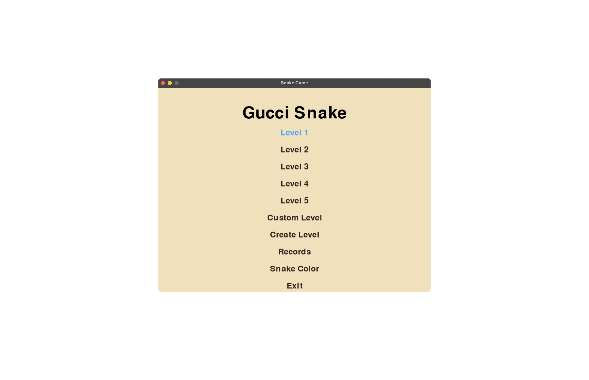
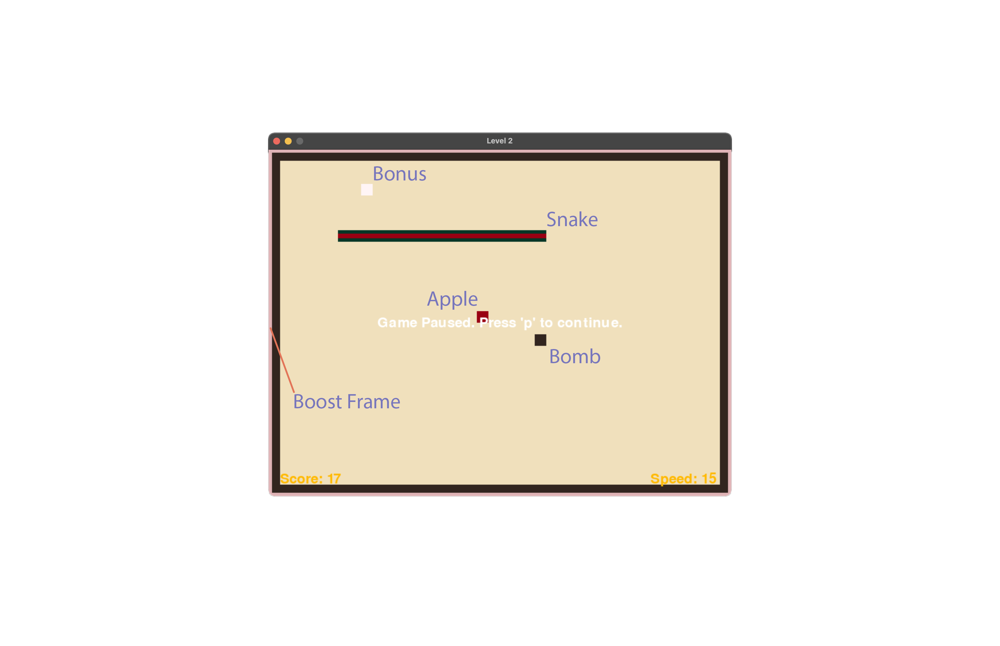

# GucciSnake game

### Description

The Snake Game is a classic video game concept where the player maneuvers a line (the "snake") that grows in length as it consumes food. The objective is to eat as much food as possible without running into the snake's own tail or the screen boundaries. This implementation of the Snake Game is developed using Python and the Pygame library.


### Features

GucciSnake game has a menu where a player can choose from different options. There are six levels (including a custom one, that player can create by choosing "Create Level" option), records table, color choose option and game exit option. The choice can be made using the arrows on the keyboard. Enter button confirmes the choice.



In "Create Level" the obstacles can be set on the screen by clicking on screen. The level can be cleared by clicking "C" on the keyboard. Еhe last action to install an obstacle can be canceled by clicking "Z" on the keyboard. The player can confirm the level by clicking Enter on the keyboard.

By choosing the "Snake Color" option the player can choose the color of a snake. The player can confirm the color by clicking Enter on the keyboard.


During the game the snake is controlled using the arrows on the keyboard. Apples in game are red. The white color bonus may appear at a random time. The snake must eat at least five apples between white bonuses. Also, a black bomb may appear during the game. When it is eaten, the game ends. Current score is in the lower left corner, current speed is in the lower right corner. There are also a speed bonuses that can appear in a random time during the game. You can recognize them by colored screen eding (whet it is rose, the speed increases, when it light-blue, the speed decreases). During the game, it is possible to pause by pressing the "P" key.




### Installation

Clone the repo. If you use Git, you can do it by using a command:

```
git clone https://github.com/AndreyPer/GucciSnake.git
```

To install the game go to folder 'GucciSnake'. and run a file 'install.sh'. You can do it by commands:

```
cd GucciSnake
chmod +x install.sh
./install.sh
```
To run the game again from the folder 'GucciSnake' you can run a file 'run.sh' by command:

```
./run.sh
```
